# ERD — vieclam88 (Phase 1)

Sơ đồ quan hệ thực thể cho 25 bảng Phase 1. Chi tiết cột đầy đủ (kiểu dữ liệu, default,
index...) xem `docs/DATABASE-DICTIONARY.md`. File này chỉ thể hiện cấu trúc quan hệ, khóa
chính/khóa ngoại, và các bảng lịch sử (không có `updated_at`, không sửa/xóa).

Quy ước đọc sơ đồ:
- `||--o{` = một-nhiều, bắt buộc ở đầu "một".
- `|o--o{` = một-nhiều, đầu "một" có thể null (quan hệ optional).
- `||--o|` = một-một, optional ở đầu "nhiều" (unique FK nullable).
- Bảng có hậu tố `_histories` / `_attempts` / `_logs` là bảng lịch sử: chỉ INSERT, không
  UPDATE/DELETE.

```mermaid
erDiagram
    users ||--o| candidates : "user_id (nullable, unique)"
    users |o--o{ applications : "assigned_to (nullable)"
    users |o--o{ lead_requests : "assigned_to (nullable)"
    users ||--o{ application_notes : "user_id"
    users |o--o{ application_status_histories : "changed_by (nullable)"
    users |o--o{ application_assignment_histories : "from_user_id (nullable)"
    users |o--o{ application_assignment_histories : "to_user_id (nullable)"
    users ||--o{ application_assignment_histories : "assigned_by"
    users ||--o{ application_contact_attempts : "contacted_by"
    users ||--o{ job_verifications : "verified_by"
    users ||--o{ export_logs : "exported_by"
    users ||--o{ favorites : "user_id"
    users ||--o{ pages : "created_by / updated_by (nullable)"
    users ||--o{ jobs : "created_by / updated_by / deleted_by (nullable)"
    users ||--o{ companies : "created_by / updated_by (nullable)"

    candidates ||--o{ candidate_contacts : "candidate_id"
    candidates ||--o{ applications : "candidate_id"
    candidates |o--o{ lead_requests : "candidate_id (nullable)"
    candidates |o--o{ candidates : "target receives merged sources"

    administrative_units ||--o{ administrative_units : "parent_id (self)"
    administrative_units ||--o{ candidates : "current_administrative_unit_id (nullable)"
    administrative_units ||--o{ industrial_parks : "administrative_unit_id"
    administrative_units ||--o{ company_locations : "administrative_unit_id"
    administrative_units |o--o{ lead_requests : "preferred_administrative_unit_id (nullable)"

    industrial_parks |o--o{ company_locations : "industrial_park_id (nullable)"
    industrial_parks |o--o{ lead_requests : "preferred_industrial_park_id (nullable)"

    companies ||--o{ company_locations : "company_id"
    companies ||--o{ company_contacts : "company_id"
    companies ||--o{ jobs : "company_id"

    company_locations ||--o{ job_locations : "company_location_id"

    company_contacts |o--o{ jobs : "company_contact_id (nullable)"

    jobs ||--o{ job_locations : "job_id (>=1 location, 1 primary)"
    jobs ||--o{ job_work_shifts : "job_id"
    jobs ||--o{ job_verifications : "job_id"
    jobs ||--o{ applications : "job_id"
    jobs ||--o{ favorites : "job_id"
    jobs |o--o{ lead_requests : "requested_job_id (nullable)"

    work_shifts ||--o{ job_work_shifts : "work_shift_id"

    recruitment_sources |o--o{ applications : "source_id (nullable)"
    recruitment_sources |o--o{ lead_requests : "source_id (nullable)"

    applications ||--o{ application_status_histories : "application_id"
    applications ||--o{ application_assignment_histories : "application_id"
    applications ||--o{ application_contact_attempts : "application_id"
    applications ||--o{ application_notes : "application_id"
    applications ||--o| lead_requests : "converted_application_id (nullable, unique)"

    users {
        bigint id PK
        enum role "candidate, staff, admin"
        string phone_normalized UK "nullable"
        string email UK "nullable"
        enum status "active, locked"
    }

    candidates {
        bigint id PK
        string public_id UK
        bigint user_id FK "nullable, unique"
        bigint current_administrative_unit_id FK "nullable"
        enum status "active, merged, anonymized"
        bigint merged_into_candidate_id FK "nullable, self"
        timestamp deleted_at "soft delete"
    }

    candidate_contacts {
        bigint id PK
        bigint candidate_id FK
        enum type "phone, email, zalo, other"
        string normalized_value
        bool is_primary
        bool is_active
    }

    administrative_units {
        bigint id PK
        bigint parent_id FK "nullable, self"
        enum type "province, city, commune, ward, special_zone, legacy_district"
        bool is_active
    }

    industrial_parks {
        bigint id PK
        bigint administrative_unit_id FK
        string slug UK "composite: administrative_unit_id + slug"
        bool is_active
    }

    companies {
        bigint id PK
        string public_id UK
        string slug UK
        enum status "active, hidden"
        timestamp deleted_at "soft delete"
    }

    company_locations {
        bigint id PK
        bigint company_id FK
        bigint administrative_unit_id FK
        bigint industrial_park_id FK "nullable"
        bool is_primary
        enum status "active, inactive"
        timestamp deleted_at "soft delete"
    }

    company_contacts {
        bigint id PK
        bigint company_id FK
        bool is_primary
        bool is_public
        timestamp deleted_at "soft delete"
    }

    jobs {
        bigint id PK
        string public_id UK
        string code UK
        string slug UK
        bigint company_id FK
        bigint company_contact_id FK "nullable"
        enum status "draft, published, paused, closed"
        enum salary_period "month, day, hour, piece, negotiable"
        timestamp deleted_at "soft delete"
    }

    job_locations {
        bigint id PK
        bigint job_id FK
        bigint company_location_id FK
        bool is_primary
    }

    work_shifts {
        bigint id PK
        string code UK
        bool is_active
    }

    job_work_shifts {
        bigint job_id FK
        bigint work_shift_id FK
    }

    job_verifications {
        bigint id PK
        bigint job_id FK
        bigint verified_by FK
        enum result "still_open, paused, closed, needs_review"
    }

    recruitment_sources {
        bigint id PK
        string code UK
        enum type "website, social, zalo, staff, referral, offline, other"
        bool is_active
    }

    applications {
        bigint id PK
        string public_id UK
        bigint candidate_id FK
        bigint job_id FK "unique together: candidate_id + job_id"
        bigint source_id FK "nullable"
        bigint assigned_to FK "nullable -> users"
        enum stage "new, contacting, consulted, interview_scheduled, interviewed, waiting_start, started, closed"
        enum close_reason "nullable"
        json submission_snapshot "history only, not for filtering"
        json job_snapshot "history only, not for filtering"
        string referral_code "nullable, no FK in Phase 1"
    }

    application_status_histories {
        bigint id PK
        bigint application_id FK
        enum from_stage "nullable"
        enum to_stage
        bigint changed_by FK "nullable"
        enum actor_type "user, system, import"
        timestamp created_at "no updated_at, append-only"
    }

    application_assignment_histories {
        bigint id PK
        bigint application_id FK
        bigint from_user_id FK "nullable"
        bigint to_user_id FK "nullable"
        bigint assigned_by FK
        timestamp created_at "append-only"
    }

    application_contact_attempts {
        bigint id PK
        bigint application_id FK
        bigint contacted_by FK
        enum channel "phone, zalo, sms, email, other"
        enum result "answered, no_answer, busy, wrong_number, callback_requested, message_sent, other"
        timestamp created_at "append-only"
    }

    application_notes {
        bigint id PK
        bigint application_id FK
        bigint user_id FK
        timestamp deleted_at "soft delete"
    }

    lead_requests {
        bigint id PK
        string public_id UK
        bigint candidate_id FK "nullable"
        bigint requested_job_id FK "nullable"
        bigint preferred_administrative_unit_id FK "nullable"
        bigint preferred_industrial_park_id FK "nullable"
        bigint source_id FK "nullable"
        bigint assigned_to FK "nullable"
        bigint converted_application_id FK "nullable, unique"
        enum status "new, contacting, converted, closed"
    }

    favorites {
        bigint id PK
        bigint user_id FK
        bigint job_id FK "unique together: user_id + job_id"
    }

    export_logs {
        bigint id PK
        bigint exported_by FK
        string export_type
        json filters "nullable"
        int row_count
        timestamp created_at "append-only"
    }

    pages {
        bigint id PK
        string slug UK
        bigint created_by FK
        bigint updated_by FK "nullable"
    }

    faqs {
        bigint id PK
        bool is_active
        int sort_order
    }

    settings {
        bigint id PK
        string key UK
    }
```

## Ghi chú đọc sơ đồ

- **Pivot tables**: `job_locations` (job ↔ company_locations), `job_work_shifts` (job ↔
  work_shifts). Cả hai có unique constraint composite, có thể cascade delete khi job bị xóa
  cứng (nhưng job có application thì không được xóa cứng — xem `.claude/rules/data-model.md`).
- **Bảng lịch sử (append-only)**: `application_status_histories`,
  `application_assignment_histories`, `application_contact_attempts`, `job_verifications`,
  `export_logs`. Không có `updated_at`, không UPDATE/DELETE sau khi tạo.
- **Soft delete**: `candidates`, `companies`, `company_locations`, `company_contacts`,
  `jobs`, `application_notes`. Xem chính sách đầy đủ ở `docs/DATABASE-DICTIONARY.md` mục
  "Chính sách xóa".
- **Self-referencing**: `administrative_units.parent_id` (phân cấp tỉnh → xã/phường),
  `candidates.merged_into_candidate_id` (gộp trùng).
- **FK nullable quan trọng**: `applications.assigned_to`, `applications.source_id`,
  `lead_requests.candidate_id` (lead có thể chưa gắn candidate), `candidates.user_id`
  (candidate có thể chưa có tài khoản).
