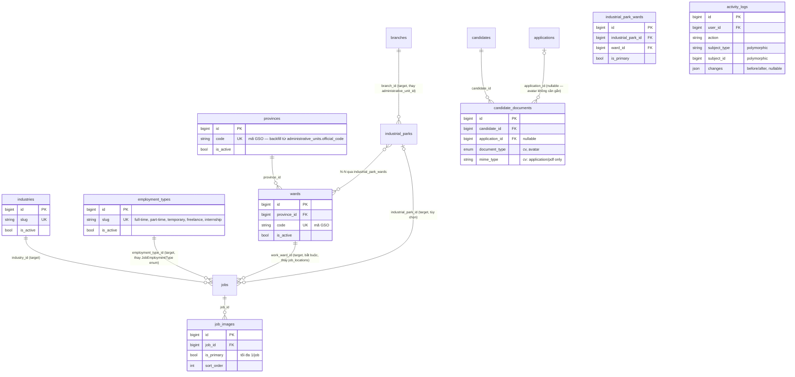

# ERD — vieclam88 (Phase 1)

Sơ đồ quan hệ thực thể cho 28 bảng business Phase 1 (27 + `candidate_duplicate_reviews`,
ADR-062). Chi tiết cột đầy đủ (kiểu dữ liệu, default,
index...) xem `docs/DATABASE-DICTIONARY.md`. 6 luồng nghiệp vụ cốt lõi mà schema này phải hỗ
trợ: `docs/CORE-FLOWS.md`. File này chỉ thể hiện cấu trúc quan hệ, khóa chính/khóa ngoại, và
các bảng lịch sử (không có `updated_at`, không sửa/xóa).

`lead_requests`, `favorites`, `application_assignment_histories` **không** nằm trong Phase 1
(ADR-021). `candidates.user_id`, `users.role=candidate`, `applications.assigned_to`,
`applications.referral_code` **không** tồn tại trong Phase 1 (ADR-021, ADR-028, ADR-029) —
không xuất hiện trong sơ đồ này.

Quy ước đọc sơ đồ:
- `||--o{` = một-nhiều, bắt buộc ở đầu "một".
- `|o--o{` = một-nhiều, đầu "một" có thể null (quan hệ optional).
- `||--o|` = một-một, optional ở đầu "nhiều" (unique FK nullable).
- Bảng có hậu tố `_histories` / `_attempts` / `_logs` là bảng lịch sử: chỉ INSERT, không
  UPDATE/DELETE (ngoại lệ: `application_appointments`, xem ghi chú bên dưới).

```mermaid
erDiagram
    users ||--o{ application_notes : "user_id"
    users |o--o{ application_status_histories : "changed_by (nullable)"
    users ||--o{ application_contact_attempts : "contacted_by"
    users ||--o{ job_verifications : "verified_by"
    users ||--o{ job_status_histories : "changed_by"
    users ||--o{ export_logs : "exported_by"
    users ||--o{ pages : "created_by"
    users |o--o{ pages : "updated_by (nullable)"
    users ||--o{ jobs : "created_by"
    users |o--o{ jobs : "updated_by (nullable)"
    users |o--o{ jobs : "deleted_by (nullable)"
    users ||--o{ companies : "created_by"
    users |o--o{ companies : "updated_by (nullable)"
    users |o--o{ application_branch_histories : "transferred_by (nullable)"
    users ||--o{ job_branch_histories : "changed_by"
    users ||--o{ application_appointments : "created_by"
    users |o--o{ application_appointments : "completed_by (nullable)"
    users |o--o{ applications : "duplicate_reviewed_by (nullable)"
    users |o--o{ applications : "reopened_by (nullable)"
    users |o--o{ candidates : "merged_by (nullable)"
    users |o--o{ candidates : "anonymized_by (nullable)"
    users |o--o{ candidate_duplicate_reviews : "reviewed_by (nullable)"

    branches |o--o{ users : "branch_id (nullable ở DB; bắt buộc khi role=staff, chốt ở Service — ADR-073)"
    branches ||--o{ jobs : "owner_branch_id (NOT NULL từ lúc tạo — ADR-046)"
    branches ||--o{ applications : "owner_branch_id (copy từ job lúc tạo)"
    branches ||--o{ application_branch_histories : "to_branch_id"
    branches |o--o{ application_branch_histories : "from_branch_id (nullable)"
    branches ||--o{ job_branch_histories : "to_branch_id"
    branches |o--o{ job_branch_histories : "from_branch_id (nullable)"

    candidates ||--o{ candidate_contacts : "candidate_id"
    candidates ||--o{ applications : "candidate_id"
    candidates |o--o{ candidates : "merged_into_candidate_id (self, 1 chiều mỗi lần merge)"

    administrative_units |o--o{ administrative_units : "parent_id (self, nullable ở root)"
    administrative_units |o--o{ candidates : "current_administrative_unit_id (nullable)"
    administrative_units ||--o{ industrial_parks : "administrative_unit_id"
    administrative_units |o--o{ company_locations : "administrative_unit_id (nullable — Quick Create, ADR-045)"
    administrative_units ||--o{ branches : "administrative_unit_id"

    industrial_parks |o--o{ company_locations : "industrial_park_id (nullable)"

    companies ||--o{ company_locations : "company_id"
    companies ||--o{ company_contacts : "company_id"
    companies ||--o{ jobs : "company_id"

    company_locations ||--o{ job_locations : "company_location_id"

    company_contacts |o--o{ jobs : "company_contact_id (nullable)"

    jobs ||--o{ job_locations : "job_id (>=1 location, 1 primary)"
    jobs ||--o{ job_work_shifts : "job_id"
    jobs ||--o{ job_verifications : "job_id"
    jobs ||--o{ job_status_histories : "job_id"
    jobs ||--o{ job_branch_histories : "job_id"
    jobs ||--o{ applications : "job_id"

    work_shifts ||--o{ job_work_shifts : "work_shift_id"

    recruitment_sources |o--o{ applications : "source_id (nullable)"

    applications ||--o{ application_status_histories : "application_id"
    applications ||--o{ application_contact_attempts : "application_id"
    applications ||--o{ application_notes : "application_id"
    applications ||--o{ application_branch_histories : "application_id"
    applications ||--o{ application_appointments : "application_id"
    applications ||--o{ candidate_duplicate_reviews : "application_id"
    candidates ||--o{ candidate_duplicate_reviews : "candidate_id (Candidate mới)"
    candidates ||--o{ candidate_duplicate_reviews : "suspected_candidate_id (Candidate nghi trùng)"

    users {
        bigint id PK
        enum role "staff, admin (không có candidate — ADR-028)"
        bigint branch_id FK "nullable; bắt buộc khi role=staff"
        string email UK "NOT NULL — định danh đăng nhập duy nhất"
        enum status "active, locked"
    }

    branches {
        bigint id PK
        string code UK
        bigint administrative_unit_id FK
        string phone "bắt buộc có phone hoặc zalo trước khi Job của cơ sở publish"
        string zalo
        enum status "active, inactive"
        timestamp deleted_at "soft delete"
    }

    candidates {
        bigint id PK
        string public_id UK
        bigint current_administrative_unit_id FK "nullable"
        enum status "active, merged, anonymized"
        string full_name_normalized "sinh tự động từ full_name, giữ dấu — ADR-063"
        bigint merged_into_candidate_id FK "nullable, self"
        string merge_reason "nullable"
        bigint anonymized_by FK "nullable"
        timestamp deleted_at "soft delete"
    }

    candidate_contacts {
        bigint id PK
        bigint candidate_id FK
        enum type "phone, email, zalo, other"
        string normalized_value
        bool is_primary
        bool is_active
    }

    administrative_units {
        bigint id PK
        bigint parent_id FK "nullable, self"
        enum type "province, city, commune, ward, special_zone, legacy_district"
        bool is_active
    }

    industrial_parks {
        bigint id PK
        bigint administrative_unit_id FK
        string slug UK "composite: administrative_unit_id + slug"
        bool is_active
    }

    companies {
        bigint id PK
        string public_id UK
        string slug UK
        enum status "active, hidden"
        timestamp deleted_at "soft delete"
    }

    company_locations {
        bigint id PK
        bigint company_id FK
        bigint administrative_unit_id FK "nullable — Quick Create, ADR-045"
        bigint industrial_park_id FK "nullable"
        string name "nhà máy/địa điểm làm việc của công ty khách hàng — không gọi 'chi nhánh'"
        string address_detail "nullable — Quick Create, ADR-045"
        enum status "active, inactive"
        timestamp deleted_at "soft delete"
    }

    company_contacts {
        bigint id PK
        bigint company_id FK
        bool is_primary
        bool is_public "chỉ là CTA phụ khi true, không thay thế contact cơ sở"
        timestamp deleted_at "soft delete"
    }

    jobs {
        bigint id PK
        string public_id UK
        bigint company_id FK
        bigint company_contact_id FK "nullable"
        bigint owner_branch_id FK "NOT NULL từ lúc tạo — ADR-046"
        enum status "draft, published, paused, closed"
        enum salary_period "month, day, hour, piece, negotiable"
        timestamp last_checked_at "nullable — mọi lần xác nhận, ADR-048"
        timestamp last_verified_at "nullable — chỉ khi result=still_open, ADR-048"
        timestamp deleted_at "soft delete"
    }

    job_locations {
        bigint id PK
        bigint job_id FK
        bigint company_location_id FK
        bool is_primary
        bigint primary_flag_job_id "generated: IF(is_primary, job_id, NULL), UNIQUE"
    }

    work_shifts {
        bigint id PK
        string code UK
        bool is_active
    }

    job_work_shifts {
        bigint job_id FK
        bigint work_shift_id FK
    }

    job_verifications {
        bigint id PK
        bigint job_id FK
        bigint verified_by FK
        enum result "still_open, paused, closed, needs_review"
    }

    job_status_histories {
        bigint id PK
        bigint job_id FK
        enum from_status "nullable"
        enum to_status
        string reason "nullable; bắt buộc khi to_status=closed"
        bigint changed_by FK
        timestamp created_at "append-only"
    }

    job_branch_histories {
        bigint id PK
        bigint job_id FK
        bigint from_branch_id FK "nullable, null = gán lần đầu lúc tạo"
        bigint to_branch_id FK
        string reason "nullable ở bản ghi đầu, bắt buộc khi đổi thủ công"
        bigint changed_by FK "NOT NULL — luôn có người thao tác"
        timestamp created_at "append-only"
    }

    recruitment_sources {
        bigint id PK
        string code UK
        enum type "website, social, zalo, staff, referral, offline, other"
        bool is_active
    }

    applications {
        bigint id PK
        string public_id UK
        bigint candidate_id FK
        bigint job_id FK "unique together: candidate_id + job_id"
        bigint source_id FK "nullable"
        bigint owner_branch_id FK "copy từ job.owner_branch_id lúc tạo, không suy ra động"
        enum stage "new, contacting, consulted, interview_scheduled, interviewed, waiting_start, started, closed"
        enum close_reason "nullable; reset khi mở lại closed→new"
        int workflow_cycle "default 1; tăng mỗi lần mở lại"
        timestamp workflow_cycle_started_at
        timestamp reopened_at "nullable"
        bigint reopened_by FK "nullable"
        string submission_token UK "NOT NULL — idempotency"
        bool needs_duplicate_review "default false"
        bigint duplicate_reviewed_by FK "nullable -> users; summary khi hết pending"
        timestamp duplicate_reviewed_at "nullable; summary khi hết pending"
        timestamp last_reapplied_at "nullable"
        json submission_snapshot "history only, not for filtering"
        json job_snapshot "history only, not for filtering"
    }

    application_status_histories {
        bigint id PK
        bigint application_id FK
        enum from_stage "nullable"
        enum to_stage
        int workflow_cycle "chu kỳ mà to_stage thuộc về"
        bigint changed_by FK "nullable"
        enum actor_type "user, system (không có import — ADR-029)"
        string note "bắt buộc khi from_stage=closed, to_stage=new"
        timestamp created_at "no updated_at, append-only"
    }

    application_contact_attempts {
        bigint id PK
        bigint application_id FK
        bigint contacted_by FK
        enum channel "phone, zalo, sms, email, other"
        enum result "reached, no_answer, busy, wrong_number, consulted, callback_requested, interview_agreed, candidate_refused, unsuitable, message_sent, other"
        int workflow_cycle "gán tại thời điểm tạo"
        timestamp created_at "append-only"
    }

    application_branch_histories {
        bigint id PK
        bigint application_id FK
        bigint from_branch_id FK "nullable, null = gán lần đầu lúc tạo"
        bigint to_branch_id FK
        bigint transferred_by FK "nullable, null = hệ thống tự gán lúc Apply"
        string reason "nullable ở bản ghi đầu, bắt buộc khi chuyển cơ sở thủ công"
        timestamp created_at "append-only"
    }

    application_appointments {
        bigint id PK
        bigint application_id FK
        enum type "callback, interview"
        timestamp scheduled_at "không sửa sau khi tạo — đổi lịch = tạo bản ghi mới"
        enum status "scheduled, completed, cancelled, no_show"
        string outcome "nullable"
        int workflow_cycle "gán tại thời điểm tạo"
        bigint created_by FK
        bigint completed_by FK "nullable"
        timestamp completed_at "nullable"
    }

    application_notes {
        bigint id PK
        bigint application_id FK
        bigint user_id FK
        timestamp deleted_at "soft delete"
    }

    candidate_duplicate_reviews {
        bigint id PK
        bigint application_id FK
        bigint candidate_id FK "Candidate mới"
        bigint suspected_candidate_id FK "Candidate nghi trùng"
        enum reason_code "same_phone_missing_dob, same_phone_different_name, same_identity_conflicting_dob, multiple_exact_matches, other"
        enum status "pending, confirmed_same, confirmed_distinct, dismissed"
        bigint reviewed_by FK "nullable"
    }

    export_logs {
        bigint id PK
        bigint exported_by FK
        string export_type
        json filters "nullable"
        int row_count
        timestamp created_at "append-only"
    }

    pages {
        bigint id PK
        string slug UK
        bigint created_by FK
        bigint updated_by FK "nullable"
    }

    faqs {
        bigint id PK
        bool is_active
        int sort_order
    }

    settings {
        bigint id PK
        string key UK
    }
```

## Sơ đồ mục tiêu Phase 2 (ADR-080)

> Sơ đồ trên (28 bảng) là **hiện trạng thật đang chạy** — không đổi. Khối dưới đây chỉ thể hiện
> quan hệ/bảng **mục tiêu** theo `docs/PHASE-2-ARCHITECTURE-PROPOSAL.md` (ADR-080), chi tiết cột ở
> `docs/DATABASE-DICTIONARY.md` mục 9.29–9.36 — không thuộc 28 bảng Phase 1 dù đã migrate hay chưa.
> `provinces`/`wards` **đã migrate ở TASK 1.1** (chưa được luồng nghiệp vụ Phase 1 đọc/ghi); 6 bảng
> còn lại (9.31–9.36) chưa có migration nào tạo ra.

**`activity_logs`: CẦN CHỐT trước khi migrate** — mâu thuẫn ADR-019 (audit trail theo từng
action, không phải 1 bảng log chung). Xem `docs/DATABASE-DICTIONARY.md` mục 9.36.

**Không đổi cùng lúc:** `administrative_units`, `company_locations`, `job_locations` vẫn giữ
nguyên tới batch Contract (batch 9) — sơ đồ target chỉ *thêm* bảng/quan hệ mới song song, không
xóa gì ở batch Expand/Backfill.

## Ghi chú đọc sơ đồ

- **Pivot tables**: `job_locations` (job ↔ company_locations), `job_work_shifts` (job ↔
  work_shifts). Cả hai có unique constraint composite, có thể cascade delete khi job bị xóa
  cứng (nhưng job có application thì không được xóa cứng).
- **Bảng lịch sử (append-only)**: `application_status_histories`,
  `application_contact_attempts`, `application_branch_histories`, `job_status_histories`,
  `job_branch_histories`, `job_verifications`, `export_logs`. Không có `updated_at`, không
  UPDATE/DELETE sau khi tạo. `application_appointments` có `updated_at` (không phải
  append-only thuần vì appointment có thể chuyển `status` sau khi tạo), nhưng `scheduled_at`
  không sửa sau khi tạo — đổi lịch tạo bản ghi mới, không ghi đè.
- **Soft delete**: `candidates` (không có route HTTP ở Phase 1 — chỉ can thiệp Admin/DB, ADR-068),
  `companies`, `company_locations`, `company_contacts`, `jobs`, `branches`, `application_notes`.
- **`candidate_duplicate_reviews`** (mới, ADR-062): không phải bảng lịch sử append-only thuần —
  `status`/`reviewed_by`/`reviewed_at`/`review_note` cập nhật sau khi Admin xử lý, giống
  `application_appointments`. Chặn review trùng bằng cột generated `pending_pair_key` (UNIQUE) —
  cùng pattern `job_locations.primary_flag_job_id`.
- **Self-referencing**: `administrative_units.parent_id` (phân cấp tỉnh → xã/phường),
  `candidates.merged_into_candidate_id` (gộp trùng — 1 chiều mỗi lần merge, không cập nhật lại
  khi merge nhiều tầng; truy vấn "merged family" đệ quy theo chuỗi này, `docs/CORE-FLOWS.md`
  mục 6.3).
- **Cơ sở nội bộ (`branches`) khác `company_locations`**: `branches` là văn phòng/chi nhánh của
  chính công ty cung ứng lao động (vieclam88), phụ trách xử lý hồ sơ; `company_locations` là
  nhà máy/địa điểm làm việc của công ty khách hàng — không gọi bảng này là "chi nhánh" (ADR-015).
  Quan hệ đúng: `administrative_units ||--o{ branches` (một đơn vị hành chính có nhiều cơ sở,
  vì `branches.administrative_unit_id → administrative_units.id`) — **đã sửa lỗi vẽ ngược**
  ở bản trước (ADR-044).
- **`jobs.owner_branch_id`**: **NOT NULL ngay từ lúc tạo Job** (không còn nullable ở `draft` —
  ADR-046). Chỉ set lúc tạo Job hoặc đổi qua `ChangeJobBranchAction` (chỉ khi Job `draft`/
  `paused`, chưa `deleted_at` — **không** khi `published` hoặc `closed`, ADR-054); mỗi lần
  gán/đổi ghi 1 dòng `job_branch_histories` (`docs/CORE-FLOWS.md` mục 1.0, 1.1). Application đã
  tạo trước đó giữ nguyên `owner_branch_id` cũ, không tự đổi theo.
- **`company_locations.administrative_unit_id`/`address_detail`**: nullable (ADR-045) — hỗ trợ
  Quick Create (`docs/CORE-FLOWS.md` mục 0.3), bắt buộc có ít nhất một trong hai trước khi dùng
  làm primary location của Job publish. Khi `industrial_park_id` khác null,
  `administrative_unit_id` bắt buộc bằng đúng tỉnh của KCN đó (ADR-052).
- **Enum Strategy (ADR-055)**: `jobs.status`/`applications.stage` dùng DB `enum()` (state
  machine trung tâm). 5 cột khác từng "đề xuất" (`company_contacts.status`,
  `jobs.employment_type`, `jobs.close_reason`, `pages.status`, `settings.type`) dùng `varchar` +
  PHP backed enum — không hiển thị `enum status` trong sơ đồ trên vì không phải kiểu DB enum
  (chi tiết: `docs/DATABASE-DICTIONARY.md`).
- **`jobs.last_checked_at`/`last_verified_at`**: 2 cột tách biệt (ADR-048) — `last_checked_at`
  cập nhật ở mọi lần xác nhận, `last_verified_at` chỉ khi `result=still_open`. Scheduler cảnh
  báo và điều kiện publish đều dùng `last_verified_at` (`docs/CORE-FLOWS.md` mục 1.2, 1.3).
- **`users` Phase 1 chỉ staff/admin**: không có giá trị `candidate` trong `users.role`, không
  có `candidates.user_id`, không có `users.phone_normalized` (mục đích cũ chỉ để đăng nhập
  candidate) — Candidate Account là Phase 2 (ADR-028). `users.email` bắt buộc (NOT NULL).
- **`applications.owner_branch_id`** copy từ `jobs.owner_branch_id` tại thời điểm tạo
  Application, không JOIN động qua `jobs`; chuyển cơ sở qua `application_branch_histories`
  (`docs/CORE-FLOWS.md` mục 6.1).
- **`applications.submission_token`**: NOT NULL, UNIQUE — idempotency cho lần submit form
  (`docs/CORE-FLOWS.md` mục 3).
- **`applications.workflow_cycle`**: chống dữ liệu Contact Log/Appointment của lần xử lý trước
  mở khóa trạng thái mới sau khi Application được mở lại (`docs/CORE-FLOWS.md` mục 5.4).
- **Không có trong Phase 1** (dời Phase 2): `lead_requests`, `favorites`,
  `application_assignment_histories`, `applications.assigned_to`, `applications.referral_code`,
  `candidates.user_id`, giá trị `candidate` trong `users.role`.
- **`company_locations.is_primary` đã bị loại bỏ khỏi schema Phase 1** (ADR-064) — không có use
  case nào đọc/ghi cột này; primary cấp Job dùng `job_locations.is_primary` (không đổi).
- **Cardinality nhiều-FK-khác-nullability** (ADR-073): các quan hệ `users↔pages/jobs/companies`
  tách riêng từng edge theo đúng nullability thật của từng cột (`created_by` bắt buộc,
  `updated_by`/`deleted_by` nullable) — không gộp chung 1 edge `||--o{` cho nhiều FK có
  nullability khác nhau như bản trước.

- **Candidate matching nhiều root (ADR-075):** query toàn bộ Candidate theo phone, resolve/dedupe
  root rồi so khớp; cấm chọn `first()`. Một Application có thể có nhiều
  `candidate_duplicate_reviews`; cờ/timestamp trên `applications` chỉ là summary khi hết pending.
- **Merged-family same-job invariant (ADR-076):** trước khi insert Application phải query cùng
  `job_id` trên toàn family; unique `(candidate_id, job_id)` chỉ là chốt chặn cấp một Candidate.
- **Company contact ownership (ADR-074):** FK `jobs.company_contact_id` không thể bảo vệ điều kiện
  cùng Company; Service bắt buộc kiểm tra contact thuộc `jobs.company_id`, active/chưa xóa.
