# ERD — vieclam88 (Phase 1)

Sơ đồ quan hệ thực thể cho 25 bảng Phase 1. Chi tiết cột đầy đủ (kiểu dữ liệu, default,
index...) xem `docs/DATABASE-DICTIONARY.md`. 6 luồng nghiệp vụ cốt lõi mà schema này phải hỗ
trợ: `docs/CORE-FLOWS.md`. File này chỉ thể hiện cấu trúc quan hệ, khóa chính/khóa ngoại, và
các bảng lịch sử (không có `updated_at`, không sửa/xóa).

`lead_requests`, `favorites` và `application_assignment_histories` **không** nằm trong Phase 1
— dời sang Phase 2 (ADR-021), không xuất hiện trong sơ đồ này.

Quy ước đọc sơ đồ:
- `||--o{` = một-nhiều, bắt buộc ở đầu "một".
- `|o--o{` = một-nhiều, đầu "một" có thể null (quan hệ optional).
- `||--o|` = một-một, optional ở đầu "nhiều" (unique FK nullable).
- Bảng có hậu tố `_histories` / `_attempts` / `_logs` là bảng lịch sử: chỉ INSERT, không
  UPDATE/DELETE (ngoại lệ: `application_appointments`, xem ghi chú bên dưới).

```mermaid
erDiagram
    users ||--o| candidates : "user_id (nullable, unique)"
    users ||--o{ application_notes : "user_id"
    users |o--o{ application_status_histories : "changed_by (nullable)"
    users ||--o{ application_contact_attempts : "contacted_by"
    users ||--o{ job_verifications : "verified_by"
    users ||--o{ export_logs : "exported_by"
    users ||--o{ pages : "created_by / updated_by (nullable)"
    users ||--o{ jobs : "created_by / updated_by / deleted_by (nullable)"
    users ||--o{ companies : "created_by / updated_by (nullable)"
    users |o--o{ application_branch_histories : "transferred_by (nullable)"
    users ||--o{ application_appointments : "created_by"
    users |o--o{ application_appointments : "completed_by (nullable)"
    users |o--o{ applications : "duplicate_reviewed_by (nullable)"

    branches ||--o{ users : "branch_id (nullable; bắt buộc khi role=staff, chốt ở Service)"
    branches |o--o{ jobs : "owner_branch_id (nullable ở draft, bắt buộc trước publish)"
    branches ||--o{ applications : "owner_branch_id (copy từ job lúc tạo)"
    branches ||--o{ application_branch_histories : "to_branch_id"
    branches |o--o{ application_branch_histories : "from_branch_id (nullable)"
    branches ||--o{ administrative_units : "administrative_unit_id"

    candidates ||--o{ candidate_contacts : "candidate_id"
    candidates ||--o{ applications : "candidate_id"
    candidates |o--o{ candidates : "target receives merged sources"

    administrative_units ||--o{ administrative_units : "parent_id (self)"
    administrative_units ||--o{ candidates : "current_administrative_unit_id (nullable)"
    administrative_units ||--o{ industrial_parks : "administrative_unit_id"
    administrative_units ||--o{ company_locations : "administrative_unit_id"

    industrial_parks |o--o{ company_locations : "industrial_park_id (nullable)"

    companies ||--o{ company_locations : "company_id"
    companies ||--o{ company_contacts : "company_id"
    companies ||--o{ jobs : "company_id"

    company_locations ||--o{ job_locations : "company_location_id"

    company_contacts |o--o{ jobs : "company_contact_id (nullable)"

    jobs ||--o{ job_locations : "job_id (>=1 location, 1 primary)"
    jobs ||--o{ job_work_shifts : "job_id"
    jobs ||--o{ job_verifications : "job_id"
    jobs ||--o{ applications : "job_id"

    work_shifts ||--o{ job_work_shifts : "work_shift_id"

    recruitment_sources |o--o{ applications : "source_id (nullable)"

    applications ||--o{ application_status_histories : "application_id"
    applications ||--o{ application_contact_attempts : "application_id"
    applications ||--o{ application_notes : "application_id"
    applications ||--o{ application_branch_histories : "application_id"
    applications ||--o{ application_appointments : "application_id"

    users {
        bigint id PK
        enum role "candidate, staff, admin"
        bigint branch_id FK "nullable; bắt buộc khi role=staff (chốt ở Service, không DB)"
        string phone_normalized UK "nullable"
        string email UK "nullable"
        enum status "active, locked"
    }

    branches {
        bigint id PK
        string code UK
        bigint administrative_unit_id FK
        string phone "bắt buộc có phone hoặc zalo trước khi Job của cơ sở publish"
        string zalo
        enum status "active, inactive"
        timestamp deleted_at "soft delete"
    }

    candidates {
        bigint id PK
        string public_id UK
        bigint user_id FK "nullable, unique"
        bigint current_administrative_unit_id FK "nullable"
        enum status "active, merged, anonymized"
        bigint merged_into_candidate_id FK "nullable, self"
        timestamp deleted_at "soft delete"
    }

    candidate_contacts {
        bigint id PK
        bigint candidate_id FK
        enum type "phone, email, zalo, other"
        string normalized_value
        bool is_primary
        bool is_active
    }

    administrative_units {
        bigint id PK
        bigint parent_id FK "nullable, self"
        enum type "province, city, commune, ward, special_zone, legacy_district"
        bool is_active
    }

    industrial_parks {
        bigint id PK
        bigint administrative_unit_id FK
        string slug UK "composite: administrative_unit_id + slug"
        bool is_active
    }

    companies {
        bigint id PK
        string public_id UK
        string slug UK
        enum status "active, hidden"
        timestamp deleted_at "soft delete"
    }

    company_locations {
        bigint id PK
        bigint company_id FK
        bigint administrative_unit_id FK
        bigint industrial_park_id FK "nullable"
        bool is_primary
        enum status "active, inactive"
        timestamp deleted_at "soft delete"
    }

    company_contacts {
        bigint id PK
        bigint company_id FK
        bool is_primary
        bool is_public "chỉ là CTA phụ khi true, không thay thế contact cơ sở"
        timestamp deleted_at "soft delete"
    }

    jobs {
        bigint id PK
        string public_id UK
        bigint company_id FK
        bigint company_contact_id FK "nullable"
        bigint owner_branch_id FK "nullable ở draft, bắt buộc trước publish"
        enum status "draft, published, paused, closed"
        enum salary_period "month, day, hour, piece, negotiable"
        timestamp deleted_at "soft delete"
    }

    job_locations {
        bigint id PK
        bigint job_id FK
        bigint company_location_id FK
        bool is_primary
        bigint primary_flag_job_id "generated: IF(is_primary, job_id, NULL), UNIQUE"
    }

    work_shifts {
        bigint id PK
        string code UK
        bool is_active
    }

    job_work_shifts {
        bigint job_id FK
        bigint work_shift_id FK
    }

    job_verifications {
        bigint id PK
        bigint job_id FK
        bigint verified_by FK
        enum result "still_open, paused, closed, needs_review"
    }

    recruitment_sources {
        bigint id PK
        string code UK
        enum type "website, social, zalo, staff, referral, offline, other"
        bool is_active
    }

    applications {
        bigint id PK
        string public_id UK
        bigint candidate_id FK
        bigint job_id FK "unique together: candidate_id + job_id"
        bigint source_id FK "nullable"
        bigint owner_branch_id FK "copy từ job.owner_branch_id lúc tạo, không suy ra động"
        enum stage "new, contacting, consulted, interview_scheduled, interviewed, waiting_start, started, closed"
        enum close_reason "nullable; reset khi mở lại closed→new"
        string submission_token UK "nullable khi có giá trị — idempotency chống double-submit"
        bool needs_duplicate_review "default false"
        bigint duplicate_reviewed_by FK "nullable -> users"
        timestamp last_reapplied_at "nullable"
        json submission_snapshot "history only, not for filtering"
        json job_snapshot "history only, not for filtering"
        string referral_code "nullable, no FK in Phase 1"
    }

    application_status_histories {
        bigint id PK
        bigint application_id FK
        enum from_stage "nullable"
        enum to_stage
        bigint changed_by FK "nullable"
        enum actor_type "user, system, import"
        string note "bắt buộc khi from_stage=closed, to_stage=new (lý do mở lại)"
        timestamp created_at "no updated_at, append-only"
    }

    application_contact_attempts {
        bigint id PK
        bigint application_id FK
        bigint contacted_by FK
        enum channel "phone, zalo, sms, email, other"
        enum result "reached, no_answer, busy, wrong_number, consulted, callback_requested, interview_agreed, candidate_refused, unsuitable, message_sent, other"
        timestamp created_at "append-only"
    }

    application_branch_histories {
        bigint id PK
        bigint application_id FK
        bigint from_branch_id FK "nullable, null = gán lần đầu lúc tạo"
        bigint to_branch_id FK
        bigint transferred_by FK "nullable, null = hệ thống tự gán lúc Apply"
        string reason "nullable ở bản ghi đầu, bắt buộc khi chuyển cơ sở thủ công"
        timestamp created_at "append-only"
    }

    application_appointments {
        bigint id PK
        bigint application_id FK
        enum type "callback, interview"
        timestamp scheduled_at "không sửa sau khi tạo — đổi lịch = tạo bản ghi mới"
        enum status "scheduled, completed, cancelled, no_show"
        string outcome "nullable"
        bigint created_by FK
        bigint completed_by FK "nullable"
        timestamp completed_at "nullable"
    }

    application_notes {
        bigint id PK
        bigint application_id FK
        bigint user_id FK
        timestamp deleted_at "soft delete"
    }

    export_logs {
        bigint id PK
        bigint exported_by FK
        string export_type
        json filters "nullable"
        int row_count
        timestamp created_at "append-only"
    }

    pages {
        bigint id PK
        string slug UK
        bigint created_by FK
        bigint updated_by FK "nullable"
    }

    faqs {
        bigint id PK
        bool is_active
        int sort_order
    }

    settings {
        bigint id PK
        string key UK
    }
```

## Ghi chú đọc sơ đồ

- **Pivot tables**: `job_locations` (job ↔ company_locations), `job_work_shifts` (job ↔
  work_shifts). Cả hai có unique constraint composite, có thể cascade delete khi job bị xóa
  cứng (nhưng job có application thì không được xóa cứng — xem `.claude/rules/data-model.md`).
- **Bảng lịch sử (append-only)**: `application_status_histories`,
  `application_contact_attempts`, `application_branch_histories`, `job_verifications`,
  `export_logs`. Không có `updated_at`, không UPDATE/DELETE sau khi tạo.
  `application_appointments` có `updated_at` (không phải append-only thuần vì appointment có
  thể chuyển `status` sau khi tạo, vd `scheduled → completed`), nhưng `scheduled_at` không sửa
  sau khi tạo — đổi lịch tạo bản ghi mới, không ghi đè.
- **Soft delete**: `candidates`, `companies`, `company_locations`, `company_contacts`,
  `jobs`, `branches`, `application_notes`. Xem chính sách đầy đủ ở
  `docs/DATABASE-DICTIONARY.md` mục "Chính sách xóa".
- **Self-referencing**: `administrative_units.parent_id` (phân cấp tỉnh → xã/phường),
  `candidates.merged_into_candidate_id` (gộp trùng).
- **FK nullable quan trọng**: `applications.source_id`, `candidates.user_id` (candidate có thể
  chưa có tài khoản), `users.branch_id` (bắt buộc khi `role=staff`, chốt ở Service, không phải
  DB constraint), `jobs.owner_branch_id` (bắt buộc trước khi publish, xem
  `docs/CORE-FLOWS.md`). **Không có `applications.assigned_to`** trong Phase 1 (ADR-021).
- **Cơ sở nội bộ (`branches`) khác `company_locations`**: `branches` là văn phòng/chi nhánh
  của chính công ty cung ứng lao động (vieclam88), phụ trách xử lý hồ sơ; `company_locations`
  là địa điểm làm việc/nhà máy của công ty khách hàng. Không dùng lẫn hai bảng này (xem
  ADR-015).
- **`applications.owner_branch_id`** copy từ `jobs.owner_branch_id` tại thời điểm tạo
  Application, không JOIN động qua `jobs` — Job đổi cơ sở sau này không ảnh hưởng Application
  đã tồn tại; chuyển cơ sở cho Application phải đi qua `application_branch_histories` (xem
  `docs/CORE-FLOWS.md` mục 6.1).
- **`applications.submission_token`**: idempotency cho lần submit form — unique khi có giá
  trị, khác với unique `(candidate_id, job_id)` vốn chống ứng tuyển lại (`docs/CORE-FLOWS.md`
  mục 3).
- **Không có trong Phase 1** (dời Phase 2, ADR-021): `lead_requests`, `favorites`,
  `application_assignment_histories`, `applications.assigned_to`.
